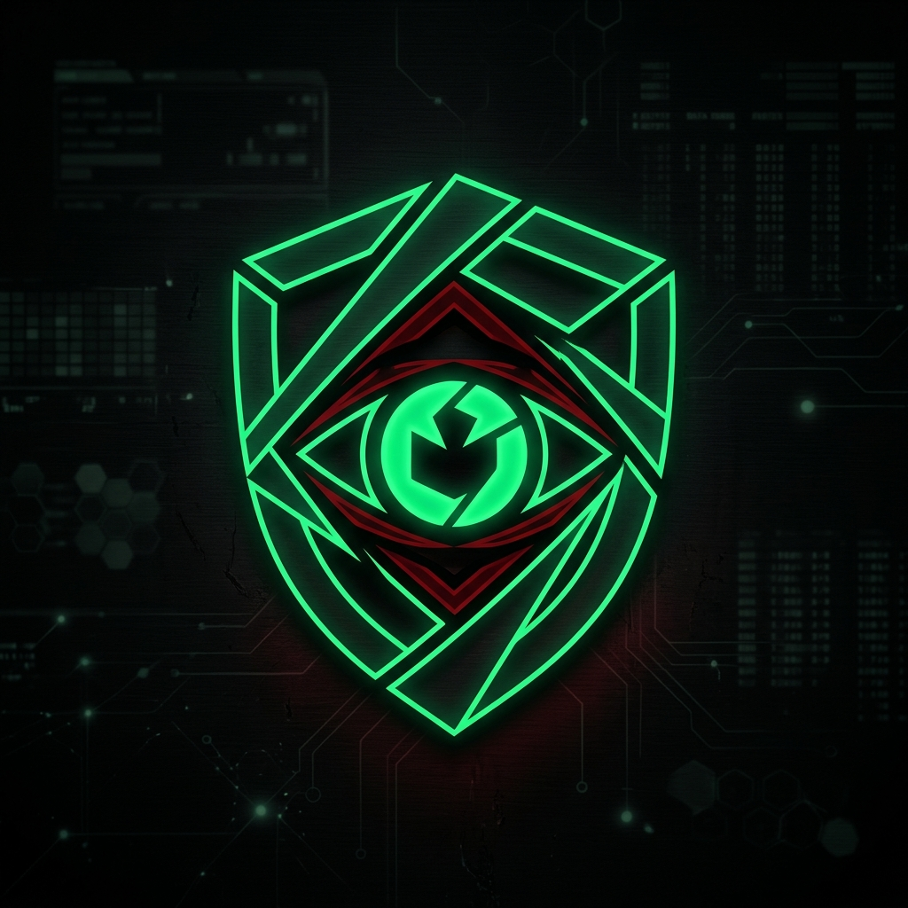

# 👁️ Sentry Node



**Sentry Node** is a React-based "Physical Oracle" and surveillance dashboard. Designed with a dense, military-grade ops center UI, it combines real-time webcam human detection via TensorFlow, simulated automated Solana security slashing, and live cross-chain vault funding via LI.FI.

## 🚀 Features

- **Military-Grade Ops UI**: A raw, dense, data-rich interface featuring CSS scanlines, sharp corners, monospace targeting HUDs, and terminal-style output logs.
- **Perception Layer (TensorFlow)**: Utilizes the device webcam and `@tensorflow-models/coco-ssd` to continuously scan the environment for unauthorized physical presence ("person" detection).
- **Audio/Visual Alerts**: Triggers flashing screen alerts and uses the Web Speech API to broadcast physical security breach warnings.
- **On-Chain Enforcement Log**: Mocks automated slashing sequences against protocol violators on the Solana network when a physical threat is detected.
- **Cross-Chain Vault Funding**: Integrated with the **LI.FI Widget**, pre-configured to actively bridge assets (e.g., Arbitrum USDC to Solana SOL) directly into the secure Sentry Vault.

## 🛠️ Technology Stack

- **Framework**: React 19 + Vite 8
- **Styling**: Tailwind CSS v4 (with extensive pure CSS scanline/HUD overrides)
- **Machine Learning**: TensorFlow.js (`@tensorflow/tfjs`) + COCO-SSD
- **Web3 Infrastructure**: 
  - `wagmi` & `@tanstack/react-query` (EVM Provider)
  - `@lifi/widget` (Cross-chain routing and bridging)
  - Solana Web3.js (Network mocked logic)
- **Icons**: Lucide React

## 📦 Installation & Setup

1. **Clone the repository:**
   ```bash
   git clone https://github.com/dishashettyyy/Sentry-Node.git
   cd Sentry-Node
   ```

2. **Install dependencies:**
   *(Note: `--legacy-peer-deps` is required to gracefully handle peer dependency resolutions between wagmi, @lifi/widget, and @mysten/dapp-kit).*
   ```bash
   npm install --legacy-peer-deps
   ```

3. **Start the Development Server:**
   ```bash
   npm run dev
   ```

4. **Initialize Sentry:**
   - Open `http://localhost:5173` in your browser.
   - Click **▶ ARM SENTRY** in the Perception Layer panel to grant webcam access and load the neural weights.
   - The LI.FI widget will automatically calculate the best route for vault funding on startup.

## ⚠️ Important Notes

- **Polyfills**: This project relies on older Web3 libraries that require Node.js core polyfills (Buffer, process, global). These are explicitly hoisted and defined in `src/main.jsx` and `vite.config.js` to prevent build and runtime crashes.
- **Hardware Access**: The Perception Layer requires active camera permissions. It runs locally in the browser; no video data is transmitted off-device.

---
*SYS_MSG: NEURAL LINK SECURE. AWAITING PROTOCOL VIOLATIONS...*
